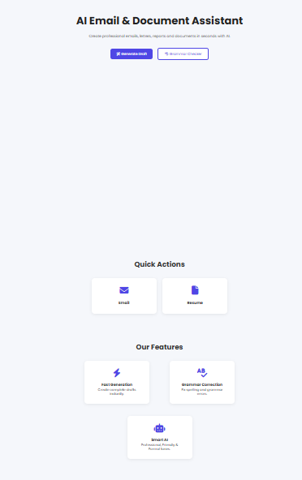

# 📧 MailMind – AI-Powered Email Assistant

MailMind is an AI-powered web application designed to simplify everyday email and career-related tasks. It provides an AI Mail Assistant for generating emails, a Grammar Checker for improving written content, and a Resume Generator for creating professional resume content.

## 🌐 Live Demo

🚀 **[Try MailMind](https://mailmind-2d3a.onrender.com)**

## ✨ Features

### 🤖 AI Mail Assistant

Generate professional and well-structured emails based on the user's requirements.

### ✍️ Grammar Checker

Check and improve grammar, spelling, sentence structure, and overall clarity of written content.

### 📄 Resume Generator

Generate professional resume content based on the user's education, skills, experience, and other details.

---

## 📸 Screenshots

### 🏠 Homepage



### 🤖 AI Mail Assistant


| Git & GitHub | Version control and source code management |


MailMind/
│
├── app.py
├── test.py
├── README.md
├── .gitignore
│
│   ├── css/
│   └── js/
│
├── templates/
│
└── screenshots/
    ├── homepage.PNG
    ├── email generator.PNG
    ├── grammer checker.PNG
    └── resume generator.PNG
```

---

## ⚙️ Run Locally

### 1. Clone the repository

```bash
git clone https://github.com/akshata-v/MAILMIND.git
cd MAILMIND
```

### 2. Create a virtual environment

```bash
python -m venv venv
```

Activate it on Windows:

```bash
venv\Scripts\activate
```

### 3. Install dependencies

```bash
pip install -r requirements.txt
```

### 4. Configure the Groq API

Create a `.env` file in the project directory:

```text
GROQ_API_KEY=your_api_key_here
```

**Never share or commit your actual API key.**

The `.env` file is excluded from Git using `.gitignore`.

### 5. Run the application

```bash
python app.py
```

Open the local Flask URL shown in the terminal.

---

## 🔐 Security

MailMind uses an environment variable to store the Groq API key.

The API key is not included in the source code or GitHub repository.

For local development, the key is stored in `.env`.

For deployment, the API key is configured securely using Render environment variables.

---

## 🚀 Deployment

MailMind is deployed using **Render** and connected to the GitHub repository.

### Live Application

**https://mailmind-2d3a.onrender.com**

Updates pushed to the `main` branch can be automatically deployed through the connected Render service.

---

## 🔄 Git Workflow

The project uses Git and GitHub for version control.

After making changes:

```bash
git add .
git commit -m "Describe your changes"
git push
```

---

## 🎯 Future Improvements

* 📧 Email reply generation
* 🎭 Email tone changer
* 📝 Email summarization
* 💡 Smart reply suggestions
* 📊 Email quality scoring
* 📄 Download generated resumes as PDF
* 🌙 Dark mode
* 👤 User authentication and saved history

---

## 👩‍💻 Developer

### Akshata V.

AI/ML Engineering Student

Built using **Python, Flask, HTML, CSS, JavaScript, and Groq API**.

---

⭐ If you find MailMind useful, feel free to explore the project and try the live demo!
├── static/
├── requirements.txt

```text
## 📁 Project Structure
---
| Render       | Application deployment                     |
| Groq API     | AI-powered features                        |
| JavaScript   | Frontend functionality                     |
| CSS          | Styling and UI                             |


| HTML         | Web page structure                         |
## 🛠️ Tech Stack
| Flask        | Web application framework                  |

| Python       | Backend programming                        |
| Technology   | Purpose                                    |
| ------------ | ------------------------------------------ |
### ✍️ Grammar Checker

